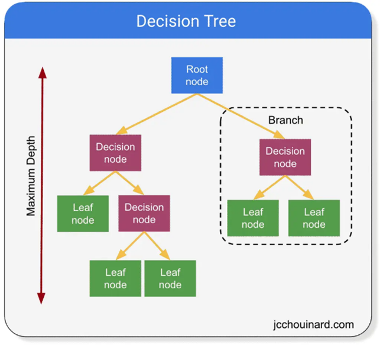

```{r setup, include=FALSE}
knitr::opts_chunk$set(echo = FALSE, comment = NA)

```


## The GOOD, The BAD & The Ugly of Using Decision Trees

[GitHub Source Code](https://github.com/candrewxs/D622)


### Introduction
Decision trees are a machine learning algorithm used for classification and regression tasks. They are supervised learning algorithms that build a model in a tree, where each internal node represents a decision based on a feature, and each leaf node represents a predicted outcome or a decision. As illustrated in Figure 1, it shows a decision tree-like structure.




\n


There are several types of decision tree algorithms based on the different programming languages, including:


1. ID3 (Iterative Dichotomiser 3): This algorithm builds a decision tree by selecting the feature that provides the most information gain at each step.

2. C4.5: This algorithm is an extension of ID3 that can handle both continuous and categorical features. It also uses an  information gain ratio instead of information gain to handle biases towards features with many values.
3. CART (Classification and Regression Trees): This algorithm can be used for classification and regression tasks. It builds binary trees, where each internal node represents a split on a feature, and each leaf node represents a predicted value.
4. Random Forest: This algorithm is an ensemble learning method that uses multiple decision trees to improve accuracy and reduce overfitting.
5. Gradient Boosted Decision Trees: This algorithm builds a decision tree ensemble by iteratively adding trees that minimize the residual errors.

In the Kaggle dataset, [Shop Customer Data](https://www.kaggle.com/datasets/datascientistanna/customers-dataset?select=Customers.csv), a business owner is looking to understand its customers. The customer's information is retrieved from their membership cards. We aim to build a decision tree algorithm to determine a qualitative response (class outcome) using a classification tree. 


```{r libraries, include=FALSE}
#Load required libraries
suppressPackageStartupMessages({
  library("tidyverse")
  library("DMwR")   #package for imbalance data
  library("rpart")   #model data
  library("rpart.plot")
  library("caret")
  library("randomForest")
  library("ggalt")
  library("data.table")
  library("reprtree")
  })

```


```{r load.data, include=FALSE, warning=FALSE, message=FALSE}
#Load the data
dfhw<- read_csv("https://raw.githubusercontent.com/candrewxs/D622/main/Customers.csv")

```


```{r glimpse.data, include=FALSE, warning=FALSE, message=FALSE, fig.cap="Table 1: Shop Customer Data"}
#View the data
glimpse(dfhw)
```


* In Part I, a classification tree model is fitted using two different features and compares results. 
* In Part II, a Random Forest algorithm is fitted with a regression tree model, and we analyze the results.
* Then, in Part III, a brief discussion on handling the "The GOOD, The BAD & The Ugly of Using Decision Tree".

\n
\n

### PART I: Building a Classification Tree Model
We use the CART decision tree algorithm to analyze the **Shop Customer Data** dataset. The dataset has `r nrow(dfhw)` observations and `r ncol(dfhw)` variables. We are interested in predicting *gender* and *annual_income* based on the other variables in the dataset. Predicting an outcome on the customer's behavior from a selected characteristic (the dependent variable or class) and how likely they make a purchase.


```{r tolower, warning=FALSE, message=FALSE}
#Change column names to lower case
names(dfhw) <- tolower(names(dfhw))
```


```{r change.names, warning=FALSE, message=FALSE}
#Change column names
names(dfhw)[4] <- "annual_income"
names(dfhw)[5] <- "spending_score"
names(dfhw)[7] <- "work_experience"
names(dfhw)[8] <- "family_size"
```


```{r stats.summary, warning=FALSE, message=FALSE, fig.cap="Table 2: Summary Statistics"}
#View the dataset statistical summary
summary(dfhw)
```

The response variables for the classification decision tree algorithms are: **gender** and **annual_income**.


In Table 2, Summary Statistics, each response variable of interest is a different type: qualitative and quantitative. The gender variable is a categorical variable that measures the quantity of each individual, whereas the annual_income is a quantitative variable whose values are either countable or have infinite possibilities. Now, we perform the following pre-processing steps on the dataset.

* Decision Tree | Classification with *gender variable and annual_income*
  
  The dataset was prepared and manipulated to resolve issues such as:
    * Changing the column names to lowercase
    * Changing the column names to remove white space between words
    * Changing numeric variables that are known to be factor variables
    * Treating inconsistencies, where the minimum values for *age* are illogical. All individuals eligible for membership must be at or above 13. Therefore, values less than 13 are treated as missing data by setting them to NA. 
    

```{r mutate.variables, include=FALSE, message=FALSE, warning=FALSE}
#Change variables, gender and profession, data type to factor
custhw <- dfhw %>%
  mutate(gender = as.factor(gender)) %>%
  mutate(profession = as.factor(profession)) %>%
  mutate(age = ifelse(age <13, NA, age))
```


```{r stats.summary2, warning=FALSE, message=FALSE, fig.cap= "Table 3: Summary Statistics (revised)"}
#View the dataset revised summary statistics
summary(custhw)
```

    
* Additionally, in **Part II**, the annual_income variable was recoded from a continuous variable to a categorical variable. The new variable, **high_income**, takes on a value of `Yes` if the annual_income variable exceeds the median value of `r format(median(dfhw$annual_income), scientific = F)` and `No` if not. 


* We split the dataset randomly into training and testing subsets in a 75:25 ratio to build each classification model.

```{r split.dataset, warning=FALSE, message=FALSE}
#Split the data set into a training and testing 
set.seed(1234)
sample_set <- sample(nrow(custhw), round(nrow(custhw)*.75), replace = FALSE)
custhw_train <- custhw[sample_set, ]
custhw_test <- custhw[-sample_set, ]

```


\n

#### Modeling


We use the `rpart` library to build the model and specify "method = class" since we are dealing with a classification dataset.


  - 1st target variable, `"gender"` model:
  
```{r target1.orig, warning=FALSE, message=FALSE, results= "hide"}
#View the target distribution (gender) in the dataset
round(prop.table(table(select(custhw, gender), exclude = NULL)), 4) * 100

```


```{r target1.train, results="hide", warning=FALSE, message=FALSE}
#View the target distribution (gender) in the training set
round(prop.table(table(select(custhw_train, gender), exclude = NULL)), 4) * 100

```


```{r target1.test, results="hide", warning=FALSE, message=FALSE}
#View the target (gender) distribution in the testing set
round(prop.table(table(select(custhw_test, gender), exclude = NULL)), 4) * 100

```


```{r smote.gender, warning=FALSE, message=FALSE}
#Use SMOTE function to resolve imbalance data (gender - response variable)
set.seed(1234)
custhw_train <- SMOTE(gender ~ ., data.frame(custhw_train), perc.over = 100, perc.under = 200)

```


```{r balance.gender, results="hide", warning=FALSE, message=FALSE}
#View balance data (response variable: gender)
round(prop.table(table(select(custhw_train, gender), exclude = NULL)), 4) * 100

```


```{r model1, echo = TRUE, message=FALSE, warning=FALSE}
custhw_mod1 <- rpart(
  gender ~ ., 
  method = "class",
  data = custhw_train)

```


  - 2nd target variable `"annual_income (aka "high_income")"` model:
  
```{r summary.target2, message = FALSE, warning=FALSE, results= "hide"}
summary(custhw$annual_income)

```


```{r echo = TRUE, warning=FALSE, message=FALSE, results="hide"}
#Creates a new binary variable, high_income.
high_income <- ifelse(custhw$annual_income <= mean(custhw$annual_income), "No", "Yes")
#Add high_income to the data set.
custhw1 <- data.frame(custhw, high_income)
#Remove the annual_income variable from the data.
custhw1 <- custhw1[, -4]
#Code high_income as a factor variable
custhw1$high_income <- as.factor(custhw1$high_income)
class(custhw1$high_income)

```


```{r split2.dataset, warning=FALSE, message=FALSE}
#Split the data set into a training and testing 
set.seed(1234)
sample2_set <- sample(nrow(custhw1), round(nrow(custhw1)*.75), replace = FALSE)
custhw1_train <- custhw1[sample2_set, ]
custhw1_test <- custhw1[-sample2_set, ]

```


```{r target2.orig, warning=FALSE, message=FALSE, results= "hide"}
#View the target distribution (high_income) in the dataset
round(prop.table(table(select(custhw1, high_income), exclude = NULL)), 4) * 100

```


```{r target2.train, results="hide", warning=FALSE, message=FALSE}
#View the target distribution (high_income) in the training set
round(prop.table(table(select(custhw1_train, high_income), exclude = NULL)), 4) * 100

```


```{r target2.test, results="hide", warning=FALSE, message=FALSE}
round(prop.table(table(select(custhw1_test, high_income), exclude = NULL)), 4) * 100

```


```{r smote.high_income, warning=FALSE, message=FALSE}
#Use SMOTE function to resolve imbalance data (high_income - response variable)
set.seed(1234)
custhw1_train <- SMOTE(high_income ~ ., data.frame(custhw1_train), perc.over = 100, perc.under = 200)

```


```{r balance.high_income, results="hide", warning=FALSE, message=FALSE}
#View balance data (response variable: high_income)
round(prop.table(table(select(custhw1_train, high_income), exclude = NULL)), 4) * 100

```


```{r model2, echo = TRUE, message=FALSE, warning=FALSE}
custhw1_mod <- rpart(
  high_income ~ ., 
  method = "class",
  data = custhw1_train
)

```


\n

#### Classification Rules

Figures 2 & 3 show the **rules** decision tree model used to make the classifications. Nwanganga et al. states that a decision tree model shows the variable (feature) most predictive of the target outcome (or class). Based on our trees (Figures 2 & 3), these are the following top three rules :

  * Model 1: target variable 'gender'
  
```{r rules.gender, warning=FALSE, message=FALSE}
#Model - Rules for response variable: gender
custhw_mod1

```
  
  

  * Model 2: target variable `high_income`

```{r rules.high_income, warning=FALSE, message=FALSE}
#Model - Rules for response variable: high_income
custhw1_mod

```
 
  

\n

#### Visualizing the Rules

Visualizing the many classifications in a graph provides a simpler view.

**Model 1: target variable - gender**
```{r plot.model1, warning=FALSE, message=FALSE}
#png(file = "Model1.png")

#Plot model1 - response variable "gender"
rpart.plot(custhw_mod1)

#Saving the file
#dev.off()


```


**Model 2: target variable - high_income**
```{r plot.model2, warning=FALSE, message=FALSE }
#Plot model2 - response variable "high_income"
rpart.plot(custhw1_mod)

```

\n

**The structure of the decision tree tells us:**

* the order in which features are evaluated within the tree are significant and predictive of the final outcome. Nwanaganga et al., states that pathways (or branches) towards the left represent agreement with the split criteria, while pathways toward the right represent disagreement with the split criteria. Let's review the left pathways.
  - Model 1 (`gender response`): root node begins when the customer is female, splits when the female has less than one year of work experience (*female = work_experience < 1*), whose family_size is less than three (*female = family_size < 3*), and terminates to predict a *17%* merchandise purchase. The
  - Model 2 (`high_income response`): root node begins when the customer do not have a high income, splits when the customer id is less than 302 (*no = customer_id < 302*), and terminates to predict customers with low income will purchase *5%* of merchandise.  


\n

#### Predicting and Evaluating the Models Using the Test Data

We have built the decision tree model with the training data to predict the response variable using the test data. Now, we use the `predict()` function, pass it in the testing subset, and specify the type as **class**. The first ten results for the models are shown below:


  * Model 1: target variable - `gender`
```{r predict.model1, message=FALSE, warning=FALSE}
#Predict Model 1 - response variable: gender
custhw_pred <- predict(custhw_mod1, custhw_test, type = "class")
head(custhw_pred, 10)

```


  * Model 2: target variable - `high_income (annual_income)` 
```{r predict.model2, message=FALSE, warning=FALSE}
#Predict Model 2 - response variable: high_income
custhw1_pred <- predict(custhw1_mod, custhw1_test, type = "class")
head(custhw1_pred, 10)

```
  
\n

How do we determine these results are good predictions? We can use the widely known **Confusion Matrix** to evaluate classification models.

Let's take a look at the results:

  * Model 1: target variable - `gender`
```{r confusion.model1, warning=FALSE, message=FALSE}
custhw_pred_table <- table(Prediction = custhw_pred, Actual = custhw_test$gender)
custhw_pred_table

```
`Model 1` generates 214 true negative (0's), 52 true positives (1's), while there are 69 false negatives and 165 false positives. 
```{r acc1, warning=FALSE, message=FALSE, results='hide'}
acc1 <- sum(diag(custhw_pred_table)) / nrow(custhw_test)
acc1

```


  
  * Model 2: target variable - `high_income (annual_income)`
  
```{r confusion.model2, warning=FALSE, message=FALSE}
custhw_pred_table2 <- table(Prediction = custhw1_pred, Actual = custhw1_test$high_income)
custhw_pred_table2

```
`Model 2` generates 110 true negative (0's), 207 true positives (1's), while there are 150 false negatives and 33 false positives
```{r acc2, warning=FALSE, message=FALSE, results='hide'}
acc2 <- sum(diag(custhw_pred_table2)) / nrow(custhw1_test)
acc2

```


**Results Discussion** 
The results show that `Model 1` has a predictive accuracy of `r (acc1*100)` percent and `Model 2` has a predictive accuracy of `r (acc2*100)` percent against their respective dataset. However, the `high_income (annual_income)` response variable provides the best performance.

\n


### PART II: Building a Random Forest Model with a Regression Tree

In a regression model, the decision tree is a popular bagging ensemble method that consists of many decision trees called a `forest`. 

We are revisiting the [Shop Customer Data](https://www.kaggle.com/datasets/datascientistanna/customers-dataset?select=Customers.csv) to predict **annual_income** based on the other variables in the dataset. `Annual_income is a continuous variable - numeric.` 

The data is prepared and manipulated to resolve issues indicated in *Part I - Building a Classification Tree Model*. However, the random forest algorithm requires all `NA`'s to be replaced. 

```{r missingNA, warning=FALSE, message=FALSE}
#Replace NAs with string
custhw2 <- dfhw %>%
  mutate(profession = replace(profession, is.na(profession), "Missing"))
```


```{r changevar, warning=FALSE, message=FALSE}
#Change variables, gender and profession, data type to factor
#Replace age < 13 with a value = 13
custhw2 <- custhw2 %>%
  mutate(gender = as.factor(gender)) %>%
  mutate(profession = as.factor(profession)) %>%
  mutate(age = ifelse(age <13, 13, age))
```

The data has `r sum(is.na(custhw2))` missing values, and the summary statistics as follow:
```{r summ.custhw2, message=FALSE, warning=FALSE}
summary(custhw2)


```


**Split the dataset to train and test**
```{r rf.split, split.custhw2, warning=FALSE, message=FALSE}
#Split the data set into a training and testing 
set.seed(1234)
sample_set3 <- sample(nrow(custhw2), round(nrow(custhw2)*.75), replace = FALSE)
custhw2_train <- custhw2[sample_set3, ]
custhw2_test <- custhw2[-sample_set3, ]


```


The regression trees, use the argument *mtry = (p/3)* variables when growing a random forest.  
```{r rf_mod, message=FALSE, warning=FALSE}
set.seed (1234)
rf_mod <- randomForest(annual_income ~ ., data = custhw2_train, 
                       mtry = 3, importance = TRUE, ntrees = 50)

rf_mod


```
The number of trees is 500 in the model and no. of variable tried at each split are 3. The model with the lowest test mean squared error (MSE) used `r which.min(rf_mod$mse)` trees. The average difference between the predicted value for annual_income and the actual observed value is `r sqrt(rf_mod$mse[which.min(rf_mod$mse)])`.

```{r include=FALSE, results='hide'}
which.min(rf_mod$mse)


```
```{r include=FALSE, results='hide'}
sqrt(rf_mod$mse[which.min(rf_mod$mse)])


```


**Visualizing the Random Forest Tree**

```{r include=FALSE}
options(repos='http://cran.rstudio.org')
have.packages <- installed.packages()
cran.packages <- c('devtools','plotrix','randomForest','tree')
to.install <- setdiff(cran.packages, have.packages[,1])
if(length(to.install)>0) install.packages(to.install)

library(devtools)
if(!('reprtree' %in% installed.packages())){
  install_github('araastat/reprtree')
}
for(p in c(cran.packages, 'reprtree')) eval(substitute(library(pkg), list(pkg=p)))


```

A random forests trees are a random subset of the features, that is built on multiple decision trees.
```{r rf_plot, message=FALSE, warning=FALSE}
reprtree:::plot.getTree(rf_mod)


```


**Variables with the most predictive power**
```{r rf.important, message=FALSE, warning=FALSE, fig.cap="Table 4: Variaable Importance"}
importance(rf_mod)


```
In the above table, the variable of importance are reported as "(1) the mean decrease of accuracy in predictions on the out of bag samples when a given variable is permuted, and (2) a measure of th total decrease in node impurity that results from splits over that variable, averaged over all trees" (James, G. et al). 


Let's view the plot of these important measures. We see that across all of the tree in the random forest model, the `customerid`, and `work_experience` are the top most important variables.
```{r rf_varImpPlot, message=FALSE, warning=FALSE}
# Get variable importance from the model fit
ImpData <- as.data.frame(importance(rf_mod))
ImpData$Var.Names <- row.names(ImpData)

ggplot(ImpData, aes(x=Var.Names, y=`%IncMSE`)) +
  geom_segment( aes(x=Var.Names, xend=Var.Names, y=0, yend=`%IncMSE`), color="skyblue") +
  geom_point(aes(size = IncNodePurity), color="blue", alpha=0.6) +
  theme_light() +
  coord_flip() +
  theme(
    legend.position="bottom",
    panel.grid.major.y = element_blank(),
    panel.border = element_blank(),
    axis.ticks.y = element_blank()
  )

```

\n


### PART III: Solving Real Problems with Decision Trees

In the article, [The Good, The Bad, & The Ugly](https://decizone.com/blog/the-good-the-bad-the-ugly-of-using-decision-trees), perceptions on how to resolve the **bad and ugly** aspects of decision trees involves several steps. Explaining the decision-making process to stakeholders, will help build trust in the model and provide transparency into the decision-making process. Addressing concerns such as the potential bias or inaccuracies to reduce concerns and build confidence in the model. It is important to provide ongoing support and updates, including training to help identify any issues and make improvements over time. 


### References
[R for Statistical Learning](https://daviddalpiaz.github.io/r4sl/trees.html)

[An Introduction to Statistical Learning with Applications in R](https://hastie.su.domains/ISLR2/ISLRv2_website.pdf)

[An Introduction to Recursive Partitioning Using the rpart Routines](https://cran.r-project.org/web/packages/rpart/vignettes/longintro.pdf)

[Plotting rpart trees with the rpart.plot package](http://www.milbo.org/doc/prp.pdf)

[KoalaTea | Random Forest in R](https://koalatea.io/r-random-forest-regression/)


## Appendix: All code for this report
```{r ref.label=knitr::all_labels(), echo=TRUE, eval=FALSE}

```


